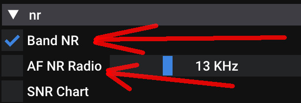
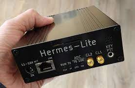

# SDR++Brown is a fork (patch-set) 

Upstream project is also very good, please check it out [by clicking here](http://sdrpp.org). I cannot recomend it enough. 
SDR++Brown is maintaining all original features from it, synchronizing the source code on regular basis.

However, this fork adds several features that could not find their way into the upstream. It is also observed that addition 
of some features in this fork improves the chances of same features appearance in the upstream!     

Note that different features in this fork have different level of maturity. Click for more details.

* [Improved rendering speed](#improved-rendering-speed)
* [Bundled FT8 decoder](#bundled-ft8-decoder) - extracted from MSHV code, slightly tweaked.
* [Hermes Lite 2 support](#hermes_lite_2_support) - hl2_source plugin.
* [Transmit mode](#transmit-mode) for Hermes Lite 2 - at the time of the writing, basic SSB transmit is implemented.
* [SNR Chart](#snr-chart) to compare SNR while tweaking antennas, denoising etc.
* Saving of zoom parameter between sessions
* Mouse wheel support on the sliders
* Unicode support in fonts (Cyrillic), filenames and installation path (UTF-8), on Windows, too.
* [Multiple output audio devices support](#multiple-output-audio-devices-support). Output to the left or right channel only.
* [More display scaling factors](#multiple-output-audio-devices-support). Output to the left or right channel only.
* [Bandwidth slider](#bandwidth-slider) to easily edit bandwidth on touch devices and not only.

## Improved rendering speed

In contrast to current upstream, this fork does not send full waterfall image to GPU on each frame, which is important 
for 4K monitors, where it burns significantly less CPU. Instead, it is tiling it and sends updates only to the one tile. 
Also, zooming and re-generation of waterfall is faster by 2-3 times by employing more optimal routines, 
which can be noticed on 4K monitors. Note, upstream author promises to implement scaling in shader, which is going to 
be even better than all this.

## Bundled FT8 decoder

Taken from great [MSHV project](http://lz2hv.org/mshv), stripped out of the Qt spaghetti, keeping the spirit of Fortran code but with C++
syntax, pure decoder currently supports FT4/FT8 simultaneous decoding. You enter your location, and you get decodes
instantly, you can even scan the band elsewhere, they are grouped by the distance, so you can 
immediately see the band condition and your antenna performance. Concurrent FT4/FT8 decoding is supported. Decoder is 
implemented as standalone binary.

## Noise reduction

Noise reduction (logmmse_noise_reduction plugin) works fine for AM/SSB/CW, this is C++ port of 
the [python implementation](https://pypi.org/project/logmmse/). It was made adaptive, so it does not require "silience" training
like original one. SDR++Brown is, af ar as I know, the only place where you can apply noise 
reduction to whole wideband and see it reflected in the waterfall. 
Secondary noise reduction can be applied independently on the audio stream, improving (or distorting) 
sound even more. Note that it will have small or, more likely, negative effect on the digital modes, 
FM modulated signal etc.

## Hermes Lite 2 support

This small device, produced by [Hermes Project](http://www.hermeslite.com/) is an interesting good SDR receiver. 
Made of cheap parts, it has 12bit ADC, 5W Power amplifier, passband filters and 48KHz transmit stream. 
It is connected via Ethernet, so it does not require any drivers.

Another implementation of same board comes from [LiteSDR project](https://www.litesdr.pp.ua/), formerly Hermes-2000, 
that is slightly less expensive, and has alternative PA and filters schematics, also it is even smaller:

## Transmit mode

Transmit mode is currently minimalistic. It supports microphone on desktop and android. It has tuning knob with physics.
It has UI (however functional) which is ugly to the degree it cannot be shown here at the moment in its full glory. 
It lacks AGC on TRX and audio level. However, I already made QSO with it in the portable mode. 
There's a picture from video of that historical moment (perspective corrected, fingers are distorted):

## SNR Chart

This shows the peaks history of SNR meter, so it allows some memory of what was before and after you changed processing.
The background noise level is calculated slightly differently than in original, showing closer to 0 in the quiet areas.
SNR chart is part of logmmse_noise_reduction plugin

## Multiple output audio devices support

You can infinitely configure outputs to the audio devices and future audio devices. On desktop, 
you can also configure left-right channel output only. 

## More display scaling factors

You can zoom in and out with bigger choices than upstream. Also, on Android, native scaling factor option is added,
which is detected on startup and brings proper scale factor right on startup.

## Small screen support

Even if you're not transmitting on your android phone, Sliders on the right will adapt to the
screen height not to cause overflow / scrollbar. They are wider for finger and re-arranged. 
The Volume slider is smaller, the frequency selection is shrunk to sub-GHz range to make more space for the SNR indicator 
(and chart). This is the default option on Android. 

## Bandwidth slider

On touch devices, it is hard to select the bandwidth with the slider on the waterfall. 
This is why slider has been added on the menu side. Large values outside of slider can 
still be entered manually.

