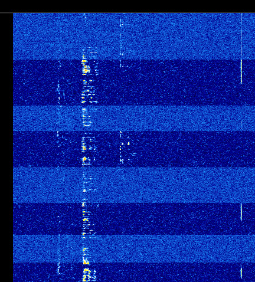
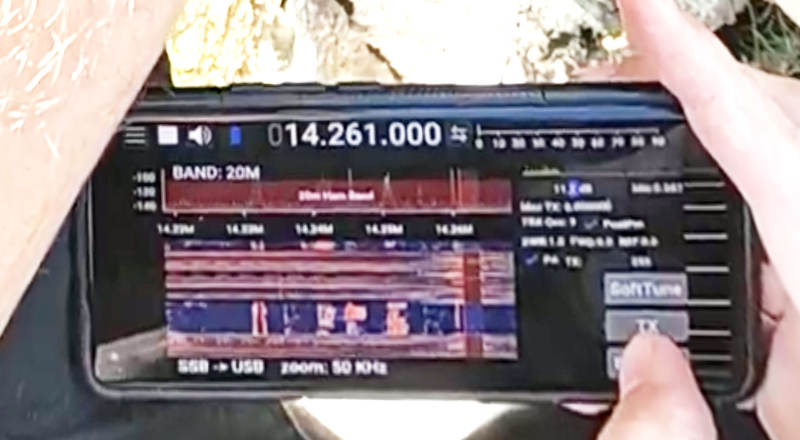
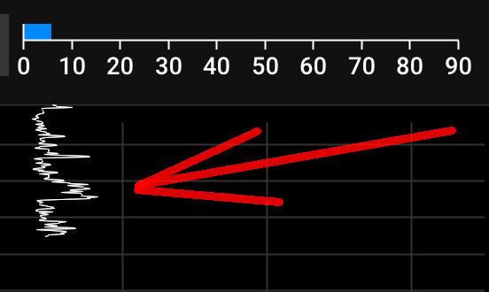
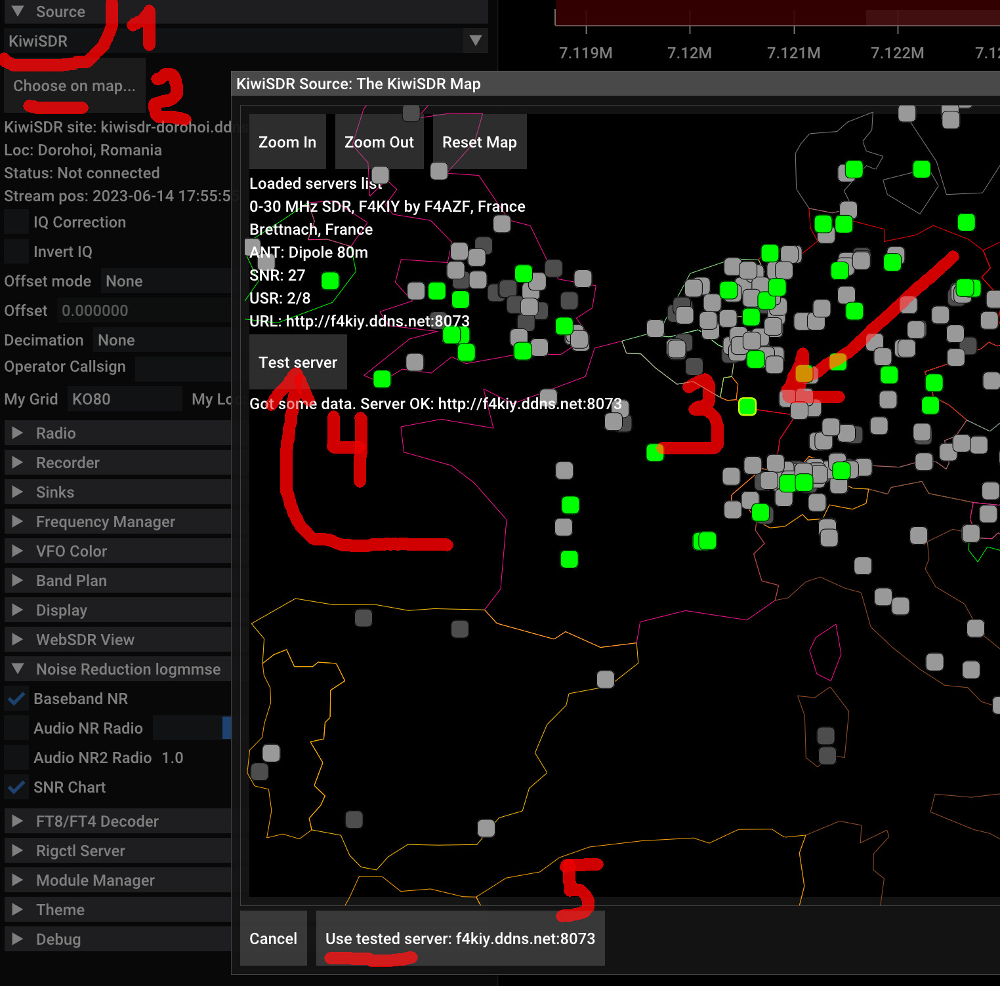
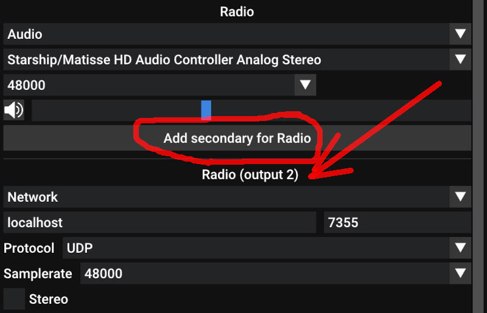
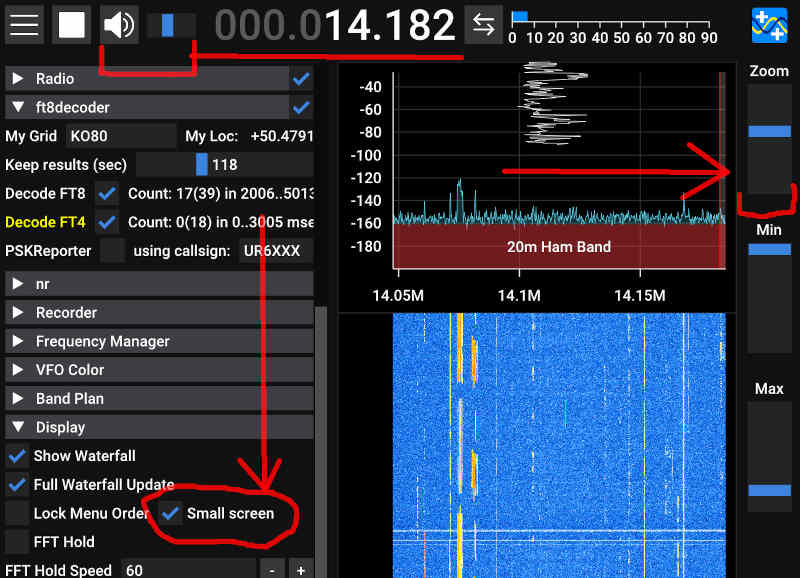
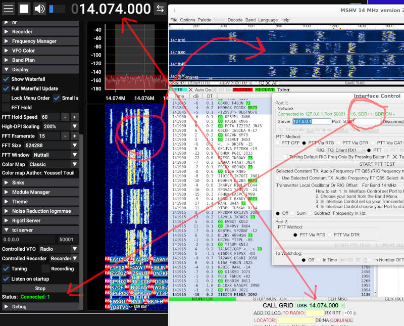

# SDR++Brown is a fork (patch-set)

* [Download a build for your platform here](https://github.com/sannysanoff/SDRPlusPlusBrown/releases/tag/rolling), and you may also download [older builds](https://github.com/sannysanoff/SDRPlusPlusBrown/actions/workflows/build_all.yml), but log in first. 
* [Changelog](https://github.com/sannysanoff/SDRPlusPlusBrown/blob/master/changelog.md)
* [Source code](https://github.com/sannysanoff/SDRPlusPlusBrown/)
* [Читать описание по-русски](https://sdrpp--brown-san-systems.translate.goog/?_x_tr_sch=http&_x_tr_sl=en&_x_tr_tl=ru&_x_tr_hl=en&_x_tr_pto=wapp) через гугл-переводчик, норм переводит, я подстраивался.
* [Telegram group](https://t.me/sdrpp_hermes_fork) for feedback.
* [Transmitting HOWTO](tx.md)  how to transmit SSB using Hermes Lite 2 and SDR++Brown.

## What is SDR++ (and its fork)

This is the software that allows display and decoding of radio frequency signals on PC and Android. To run the software, you
need the hardware that can receive radio signals, such as [RTL-SDR](https://www.rtl-sdr.com/), [Airspy](https://airspy.com/).
If you're not lucky enough, you can use [KiwiSDR](https://kiwisdr.com/) or [WebSDR](https://websdr.org/) to see how it feels.
You can try KiwiSDR right in the SDR++Brown.

## Why fork?

Original SDR++ project is very good, so I am standing on the shoulders of the giants (Alexandre Rouma and others) 
please check it out [by clicking here](http://sdrpp.org). My best recommendations. 

This ***fork adds lots of features that could not, however, find their way into the main project.*** 
It has also been observed that addition of some features in this fork improves the chances of same features appearance in the main project!

SDR++Brown is maintaining all original features from main project, the synchronization of the source code happens on regular basis.
Because it is less tested (smaller user base), you can find occasional bugs.

Note that different features in this fork have different level of readiness. Click for more details on each feature, or 
read on below.

* [Even more improved rendering performance](#improved-rendering-performance)
* [Bundled FT8 decoder](#bundled-ft8-decoder) - extracted from MSHV code, slightly tweaked.
* [Noise Reduction](#noise-reduction) - both for audio frequency and baseband (visual noise reduction!)
* [Hermes Lite 2 support](#hermes-lite-2-support) - hl2_source plugin (don't confuse with hermes_source).
* [Transmit mode](#transmit-mode) for Hermes Lite 2 - SSB QSO supported in full. See the [MANUAL](tx.md)
  * record and then transmit the SSB CQ call to the air.
  * [transmit CQ](#self-monitoring-using-digital-modes) in CW/FT8/WSPR in one button. (some kind of QSO dialogue is planned for later where applicable)
* [SNR Chart](#snr-chart) during RX to compare SNR while tweaking antennas, de-noising etc.
* [SNR Chart during TX](#websdr-view) (using multiple remote kiwisdr) to compare SNR while transmitting.
* RBN/pskreporter/WSPRnet continuous monitoring for your own call (estimate your signal when tuning your antenna)
* [QSO / SWL Logging](#qso-logging) allows to add log records with date/time/frequency/callsign/rst etc. Optimized for mobile.
  * single-button save of the audio recording of your QSO (wav file) up to 3 minutes long.
* Saving of zoom parameters between sessions
* Mouse wheel support on the sliders
* Unicode support in fonts (Cyrillic), filenames and installation path (UTF-8), on Windows, too.
* For Airspy HF+, added Fill-In option which cuts edge sides of the spectrum which are attenuated (low passed) by hardware.
* When replaying WAV file, shows the timestamp, matching the factual time of the recording.
* [KiwiSDR support](#kiwisdr-support) (12 KHz bandwidth)
* [Multiple output audio devices support](#multiple-output-audio-devices-support). Also, possibility to output to the left or right channel only.
* [More display scaling factors](#more-display-scaling-factors). 
* [Bandwidth change slider](#bandwidth-slider) to easily edit bandwidth on touch devices.
* [TCI protocol](#tci-protocol) (basic), output only. Tested to work with MSHV software. 
* [Roadmap](#roadmap)

## Improved rendering performance

In contrast to current upstream, this fork does not send full image of waterfall to the GPU on each frame, which is important 
for 4K monitors; it burns significantly less CPU by implementing waterfall as tiles and sending 
updates only to the single tile, thus reducing consumed system memory bandwidth.

Also, zooming and re-generation of waterfall is faster by 4-6 times by employing vector operations and multithreading, 
which can be noticed especially on higher FFT sizes. Note: upstream author promises to implement scaling in shader, 
which is going to be even better than all this.

## Bundled FT8 decoder

Borrowed from great [MSHV project](http://lz2hv.org/mshv), stripped out of the Qt-specific code, made lightweight, 
keeping the spirit of Fortran legacy but with C++ syntax, this pure decoder currently supports FT4 and FT8 modes. 
You enter your location, and you get decodes grouped by the distance. 
You can even tune on the other frequency, it will keep decoding, while it's within the SDR wideband. 
Using this decoder, you can immediately see the band condition and your antenna performance, because FT8-addicted ham operators are always on the air and fill it with their 
signals. Simultaneous FT4/FT8 decoding is supported. Decoder is implemented as standalone executable. Detection of secondary streams 
(appearing during DX expeditions) is planned. WSJTX-compatible log file can be generated.

## Noise reduction

Noise reduction (logmmse_noise_reduction plugin) works fine for AM/SSB/CW, this is C++ port of 
the [python implementation](https://pypi.org/project/logmmse/). It was made adaptive, so it does not require "silence" training
like original one.

Update: Recently, second noise reduction algorithm was added, which is OMLSA_MCRA (googlable). Credits go to chinese comrades who 
seem to be related to original paper, or their friends.  

It is remarkable that SDR++Brown is, af ar as I know, the only place where you can apply noise 
reduction to whole wideband and see it reflected in the waterfall. 
Secondary noise reduction can be applied independently of the wideband, it is performed on the audio stream, improving 
(or distorting, whatever you prefer) sound even more. Note that this noise reduction will have small or, more likely, negative effect on the digital modes, 
FM modulated signal etc.

## Hermes Lite 2 support

This small device, produced by [Hermes Project](http://www.hermeslite.com/) is an interesting good SDR transciever. 
Made of cheap parts, it has 12bit ADC, 5W Power amplifier, pass-band filters and 48KHz transmit stream bandwidth. 
It is connected via Ethernet, so it does not require any drivers.

Another implementation of same transceiver comes from [LiteSDR project](https://www.litesdr.pp.ua/), formerly Hermes-2000, 
that is slightly less expensive, and has alternative PA and filters schematics, also it is even smaller:

Update 2023-06-18: in addition to UDP broadcast discovery, you can now specify direct IP for discovery packet,
or, if it was not enough, you can even skip discovery and pretend it has been successfully discovered at given
IP address (Hermes Lite 2).

## Transmit mode

Transmit mode is currently SSB-oriented. It supports microphone on desktop OS and built-in microphone on android. 
There's an old picture from video of that first historical moment (perspective corrected, fingers are distorted):

Since 2 May 2023 there's a [TX documentation](tx.md), you're welcome.

## QSO Logging

Logging is optimized for mobile devices, so it is possible to add a log record with a few taps, also 
important because you don't want to spend extra hand for pencil & notebook. Logging is available in QSO mode,
you must press "Lock" (shortcut: Scroll-Lock). Enter key adds a QSO record. Scroll lock again will close and forget.
Inside the text, 1st word is DX callsign, then op name, then qth. If Rnn, Snn, nn is encountered
it is parsed as received/sent RST. Remainder of text is comment. UI is minimal. Text file "qso.log" is written.
Haptic feedback on Android.

## Websdr View

You can manually add multiple kiwisdr waterfalls. They will be displayed in multiple windows. To
save you from kiwisdr network ban by IP, by default you can only view them for the duration less than
minute all together at a time. Use with caution! Respect their bandwidth.

Use for that is self-monitoring of your own transmission. Press "Soft Tune" and
observe your signal on multiple remote websdrs, give yourself an estimate of propagation and
your antenna properties.

## Self-monitoring using digital modes

You can easily transmit CQ in FT8, WSPR or CW mode in single press of a button and immediately observe your signals on related monitoring services
such as [PSKReporter](https://pskreporter.info/pskmap.html) or [WSPRnet](https://wsprnet.org/drupal/wsprnet/map)
or Reverse Beacon Network. This is a good way to estimate your antenna performance and propagation conditions.

Feedback from those services is integrated into the application, which is useful during portable 
operations, or other conditions.

## SNR Chart

This shows the peaks history of SNR meter, so it allows objective comparison of what was before and after you changed 
signal processing or switched between your antennas. The background noise level is calculated slightly differently than in original, showing closer to 0 in the quiet areas.
SNR chart is part of logmmse_noise_reduction plugin

## KiwiSDR Support

It is possible to connect to almost any KiwiSDR and use it as a receiver. The way it works: it requests raw iq data
from the selected service, and does all processing locally. Due to internet bandwidth saving restrictions in kiwisdr server,
radio bandwidth is limited to 12 kHz (50 KB/sec). Also note some servers have their frequency drifted slightly, so no worry if you 
encounter such phenomenon. Kiwisdr list is cached locally for an hour after network request. 
Excuse the minimalistic underlying vector art, hope you recognize familiar shapes of countries. 
Shapes are taken from some geojson file, whose attribution is probably openstreetmap. 

To use the KiwiSDR source in SDR++Brown, follow the order of actions on the below picture. Allow map to load first.

It is recommended not to abuse kiwisdr because they are known to ban you by IP.

## Multiple output audio devices support

You can infinitely configure outputs to the audio devices and other sink devices. On desktop OS, 
you can also configure left or right channel output only. 

## More display scaling factors

You can zoom in and out with bigger choices than in main project. Also, on Android, native scaling factor option is added,
which is detected on startup and brings proper scale factor right from beginning.

## Small screen support

Even if you're not transmitting on your android phone, but still use SDR++ here, sliders on the right will adapt to the
screen height not to cause overflow / scrollbar. They are wider for finger and re-arranged. 
The Volume slider was made smaller, the frequency selection was shrunk to sub-GHz range to make more space for the SNR indicator 
(and chart). This is the default option on Android. 

## Bandwidth slider

On touch devices, it is hard to select the bandwidth directly on the waterfall. 
This is why slider has been added on the menu side. Large values outside of slider can 
still be entered manually.

## TCI protocol

This is a basic implementation of TCI connector, which is a protocol for remote control of transceivers by software. It 
currently allows only uni-directional stream from SDR++ to the consumer (here, MSHV). And bi-directional
synchronization of freqency etc. It supports both audio and wideband data transfer to the consumer. 
I plan to add bi-directional transfer and couple it with the SDR++Brown transmit pipeline. 
So far, it works for me with MSHV (2.69 tested), but it has not been tested by someone else. Please become a tester. 
Demand the TCI support from all other software you use!

## Roadmap

Direction of this fork development:

* To keep in sync with original project.
* To hear and decode more.
* To Transmit with ease, with attention to Android, for portable operations.
* To add more non-canonical and controversial ideas.

